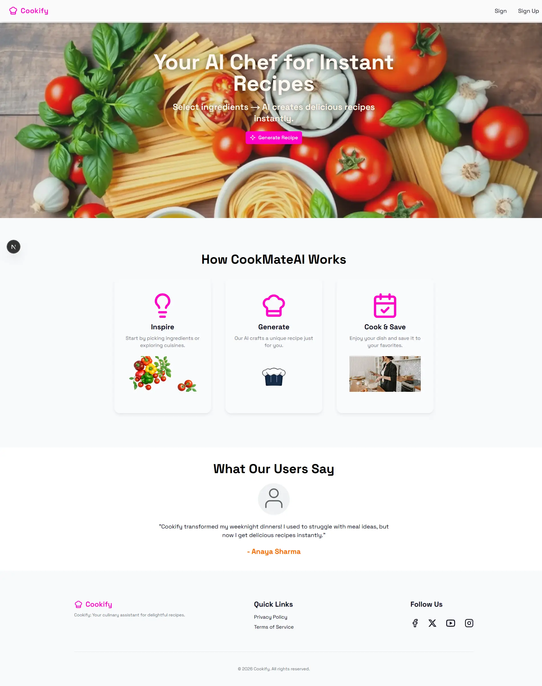
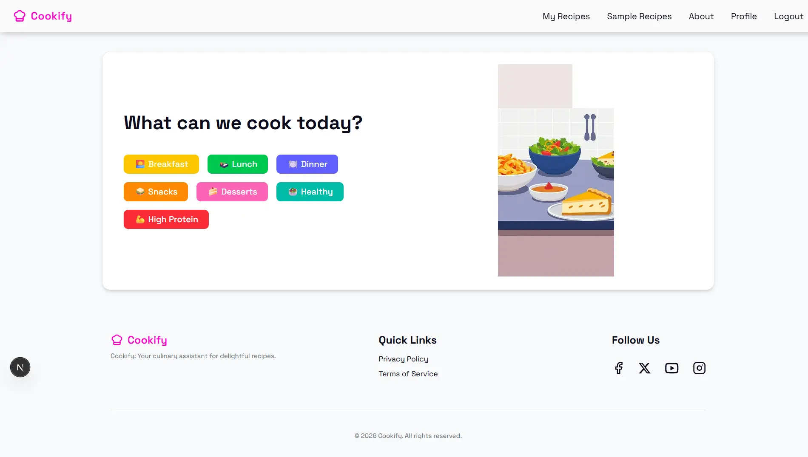
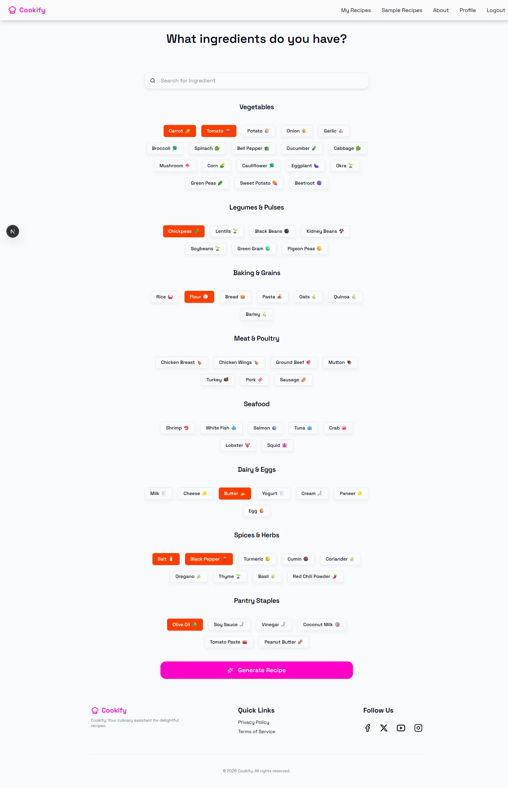
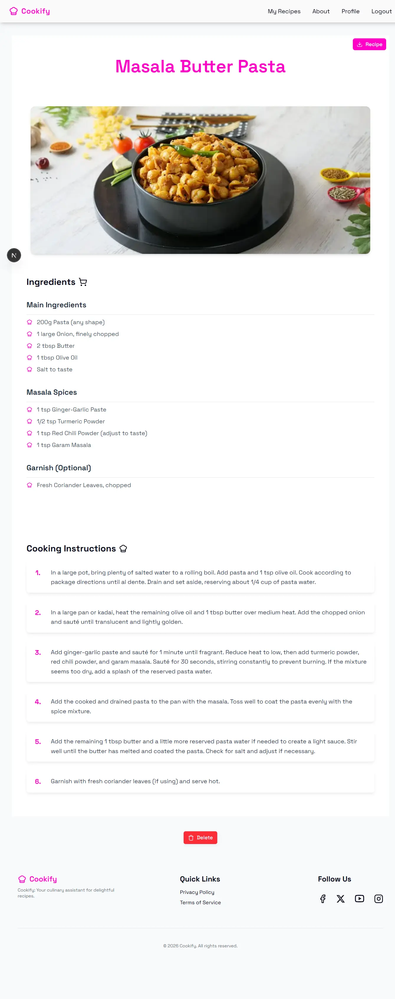
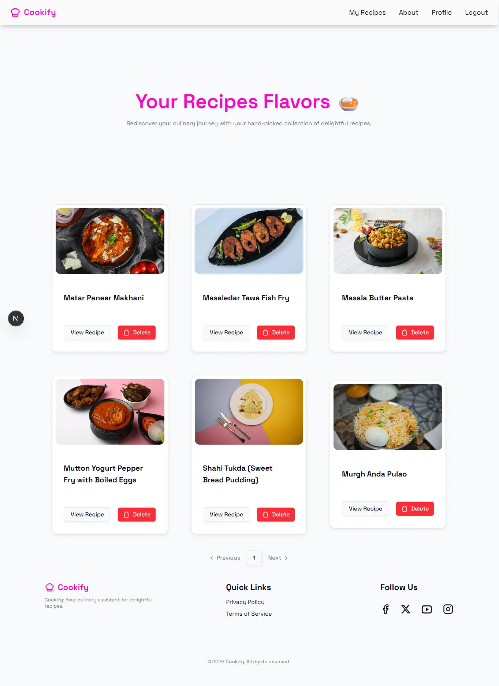
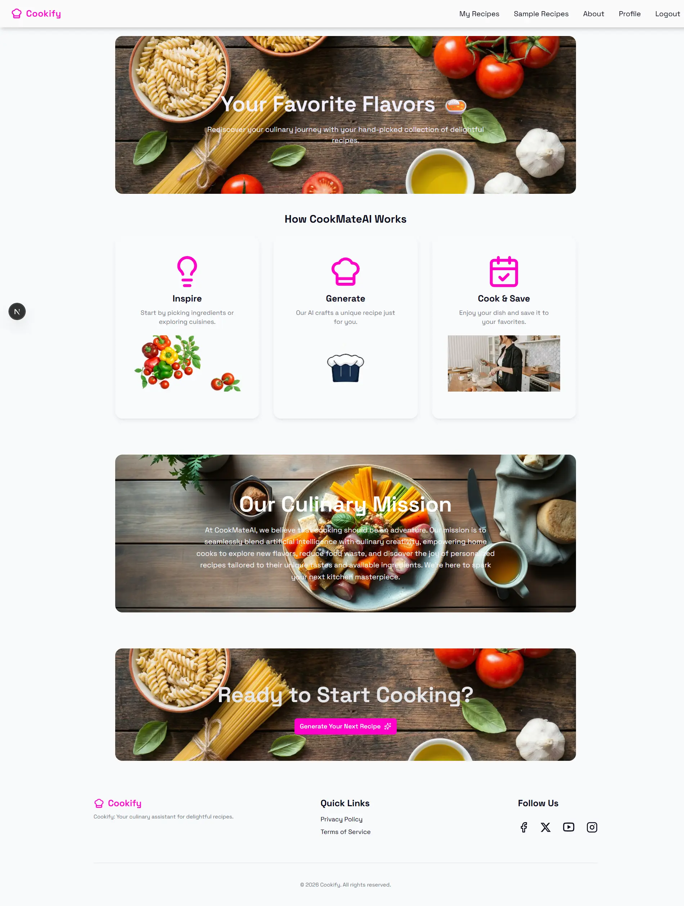
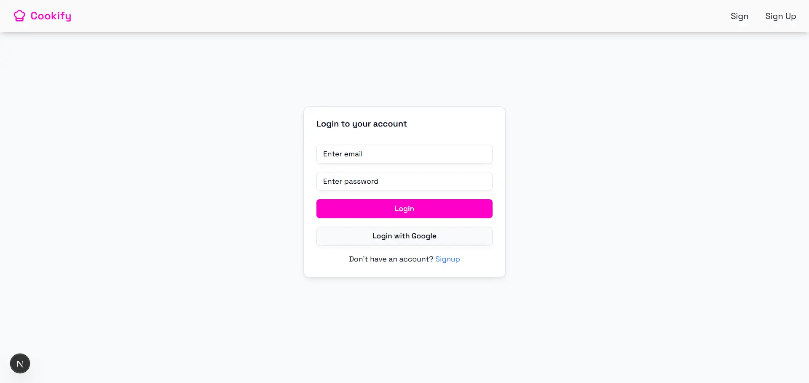

# 🍳 Cookify - AI Recipe Generator

Cookify is an intelligent recipe generator that transforms the ingredients you have on hand into delicious, step-by-step meal instructions. Powered by Google's Gemini AI, it delivers personalized and creative cooking ideas tailored to your tastes and dietary preferences.

## ✨ Key Features

*   🤖 **AI Recipe Generation:** Creates unique recipes based on user-selected ingredients and food type (Veg, Vegan, Non-Veg) using the Google Gemini API.
*   🔐 **User Authentication:** Secure sign-in with Google via NextAuth.js, enabling a personalized experience.
*   📚 **Personal Recipe Book:** Automatically saves all generated recipes to the user's profile for easy access.
*   🗑️ **Recipe Management:** Users can view their collection of recipes with pagination and delete any they no longer need.
*   🖼️ **Dynamic Imagery:** Fetches beautiful, relevant dish images from the Pexels API to accompany each recipe.
*   📄 **PDF Export:** Download any recipe as a clean, printable PDF document.
*   👤 **Profile Customization:** Users can edit their profile name.
*   📱 **Responsive UI:** A modern and intuitive interface built with Next.js, Tailwind CSS, and Shadcn/UI that works great on all devices.

## 📸 Screenshots

### 🏠 Landing Page



### 🍽️ Recipe Type Selection



### 🥕 Ingredient Selection



### 📖 Generated Recipe



### 📚 My Recipes



### ℹ️ About Page



### 🔐 Login Page



## 🛠️ Tech Stack

*   **Framework:** Next.js (App Router)
*   **Frontend:** React, Tailwind CSS, Shadcn/UI, Radix UI
*   **State Management:** Zustand
*   **Backend:** Next.js API Routes
*   **Database:** MongoDB, Mongoose
*   **AI & APIs:** Google Gemini API, Pexels API
*   **Authentication:** NextAuth.js
*   **Utilities:** Axios, Lucide React, react-toastify, jspdf

## 📂 Project Structure

```
.
├── app/
│   ├── api/              # Backend API routes (auth, generate, recipes)
│   ├── (pages)/          # UI pages for the application
│   └── layout.js         # Root layout
├── components/
│   ├── ui/               # Reusable UI components from Shadcn/UI
│   └── *.jsx             # Custom components (Header, Footer, Dialogs)
├── lib/
│   ├── gemini.js         # Google Gemini API integration
│   ├── mongoose.js       # MongoDB connection handler
│   ├── pexel.js          # Pexels API integration
│   └── data.js           # Static data (ingredients, sample content)
├── models/
│   ├── Recipe.js         # Mongoose schema for recipes
│   └── User.js           # Mongoose schema for users
└── store/
    ├── use-auth-store.jsx  # Zustand store for authentication state
    └── use-food-store.jsx  # Zustand store for recipe and ingredient state
```

## ⚙️ Environment Variables

Create a `.env.local` file in the root of the project and add the following variables:

```env
# Google Gemini API
GEMINI_API_KEY=your_google_gemini_api_key

# Pexels API for images
PEXELS_API_KEY=your_pexels_api_key

# MongoDB
DB_URI=your_mongodb_connection_string

# NextAuth.js Google Provider
GOOGLE_CLIENT_ID=your_google_oauth_client_id
GOOGLE_CLIENT_SECRET=your_google_oauth_client_secret

# NextAuth.js Configuration
NEXTAUTH_SECRET=a_random_secret_string_for_session_encryption
NEXTAUTH_URL=http://localhost:3000
```

## 🚀 Getting Started

Follow these steps to get the project running locally:

1.  **Clone the repository:**
    ```sh
    git clone https://github.com/codewithmanohar/cookify.git
    cd cookify
    ```

2.  **Install dependencies:**
    ```sh
    npm install
    ```

3.  **Set up environment variables:**
    Create a `.env.local` file in the project root and populate it with the variables listed above.

4.  **Run the development server:**
    ```sh
    npm run dev
    ```

5.  Open [http://localhost:3000](http://localhost:3000) in your browser to see the application.

## 💡 How It Works

1.  **Login:** A user logs in using their Google account to access the app's full features.
2.  **Select Preferences:** On the main screen, the user selects a dietary preference: Vegetarian, Vegan, or Non-Veg.
3.  **Choose Ingredients:** The user is then guided to a page where they can choose the ingredients they have available.
4.  **Generate:** Upon clicking "Generate Recipe," a request containing the preferences and ingredients is sent to a Next.js API route.
5.  **AI Magic:** The backend calls the Google Gemini API to create a detailed recipe. The Gemini configuration uses `responseSchema` to ensure the output is always a valid, structured JSON.
6.  **Find Image:** Simultaneously, the Pexels API is queried to find a suitable image for the generated dish name.
7.  **Save & Display:** The complete recipe (text and image URL) is saved to the user's profile in the MongoDB database and returned to the user for display.
8.  **Manage:** Users can find their creations in the "My Recipes" section, from where they can view, delete, or download them as a PDF.